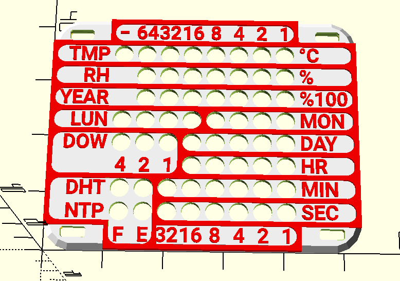

# WEMOS D1 mini Binary clock

This is a private project. No support is provided. No input expected. Also as soon as I finish 1st version, I will
probably not work on it anymore.

Esp8266 based, IKEA Skadis mounted, NTP synchronized, "smart" binary clock with temperature and humidity sensor.

Binary clock based on a WEMOS D1 mini and a 8x8 LED matrix. Shows the seconds, minutes, hours, day in month, day in
week, month, lunar phase and last two decimal digits of year in binary format.
Also uses a DHT sensor to show the temperature and humidity.
Time is synchronized via NTP.

Two buttons allow to disable display and set the brightness.

## How to read the clock

- Columns correspond to bits. Read them as (from right to left): 1, 2, 4, 8, 16, 32, 64.
- 8th bit is used for temperature as a sign bit (0 - positive, 1 - negative).
- Some rows have different meaning for top-most bits, but it should be obvious, once you get the idea.
- Labels on display cover should guide you.

### Rows

Rows from top to bottom:

- **1st row**: temperature (in Celsius) - 8th bit is a sign bit (0 - positive, 1 - negative)
- **2nd row**: relative humidity (in %) - 8th bit is not used (and it is also not visible on the display)
- **3rd row**: years - last two decimal digits (or year % 100, if you prefer), 8th bit is not used
  plate place is occupied by temperature labels)
- **4th row**:
    - Bits 1 - 4: months (1 = January, 12 = December)
    - Bits 5 - 8: lunar phase (see description below)
- **5th row**:
    - Bits 1 - 5: day in month
    - Bits 6 - 8: day of week - read from right to left - 6th bit means 1, 8th bit means 4 (1 = Monday, 7 = Sunday)
- **6th row**:
    - Bits 1 - 5: hours (24h format)
    - Bits 6 - 8: not used (and on the display plate place is occupied by day of week labels)
- **7th row**:
    - Bits 1 - 6: minutes
    - Bits 7 - 8: status bits for DHT sensor. 7 - last read failed (**E**rror), 8 - reading sensor in progress (**F**
      etching)
- **8th row**:
    - Bits 1 - 6: seconds
    - Bits 7 - 8: status bits for NTP synchronization. 7 - last synchronization failed (**E**rror), 8 - time
      synchronization in progress (**F**etching)

### Lunar phase

| Bits 5 - 8 | Lunar phase     | 🌝 |
|------------|-----------------|----|
| 0000       | New moon        | 🌑 |
| 0001       | Waxing crescent | 🌒 |
| 0011       | First quarter   | 🌓 |
| 0111       | Waxing gibbous  | 🌔 |
| 1111       | Full moon       | 🌕 |
| 1110       | Waning gibbous  | 🌖 |
| 1100       | Last quarter    | 🌗 |
| 1000       | Waning crescent | 🌘 |

## Hardware

- WEMOS D1 mini
- 8x8 LED matrix with MAX7219 controller (FC-16)
- DHT22 sensor
- 2 buttons
- 4 pull-up 10kOhm resistors (2 for the buttons, 1 for the DHT sensor and 1 for reset pin)

## Software

The software is written as arduino project mostly in C++ and can be found in the `esp8266-binary-clock` folder (to
satisfy arduino project structure).

### Dependencies

- **DHT library** by Bert Melis ([GitHub](https://github.com/bertmelis/DHT))
- **NTP library** by Stefan Staub ([GitHub](https://github.com/sstaub/NTP))
- **LedController** library by Noah Kirschmann ([GitHub](https://github.com/noah1510/LedController))
- **moonPhaser** library by Steve Sienkowski ([GitHub](https://github.com/steve-sienk/moonPhaser-avr0))

### Configuration

- Create `secrets.h` in the `esp8266-binary-clock` and specify your WiFi credentials. (see `secrets.h.example`)
- Adjust `CONFIGURATION` section and `initTimezoneAndDST` method in `esp8266-binary-clock.ino` to your needs (or just
  leave as is).
    - `DHT_INTERVAL_S` - interval for reading DHT sensor (in seconds), default 1 minute
    - `NTP_INTERVAL_S` - interval for NTP synchronization (in seconds), default 12 hours

## PCB

The PCB is designed in KiCad and can be found in the `pcb` folder. Size of the PCB board is 66 x58 mm with LED matrix
and DHT22 sensor overhanging the board.
Board is actually pretty simple and uses just one Cu layer and 0.5mm clearance between tracks. You need to use 1.6mm PCB
thickness or adjust the case (bottom part).

## Case

The case is designed in OpenScad and can be found in the `case` folder. Optimized (well as much as I was able to...) for
FDM 3D printing.

- optimized for 0.4mm nozzle and 0.2mm layer height
- tested with PLA
- no supports
- 2 perimeters and 15% infill is more than enough

Case is divided into 3 parts:

- bottom (`case_bottom.scad`)
- top (`case_top.scad`)
- display cover (`display_plate.scad`)

One can render all parts with the `case.scad` file.

All the parts should snap together without any screws or glue.

### Dependencies

- **BOSL library** by Revar Desmera ([GitHub](https://github.com/revarbat/BOSL)).
- **Roboto** (bold) font by Christian Robertson ([Google fonts](https://fonts.google.com/specimen/Roboto0)).

### Case bottom

Case is printed with supports that are included in the model. Do not add supports in slicer! After printing, remove
the "triangle" simply by tilting it back and forth
and "mouse ears" with a knife.

Assembled PCB (optimized for 1.6mm height) should fit into the model without any screws or glue. Some force is needed to
snap it in.

### Case top

- *(Optional)* color change at heights:
    - Start with color for "ventilation" grids.
    - Change color at 1.4mm for the base one.

### Display cover

- Use some pretty contrast colors for the display cover. Change filament color at the height of 1.2mm.
- *(Optional)* Use nozzle of 0.25mm for better readability of the labels.
